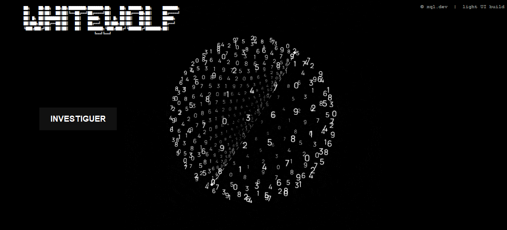
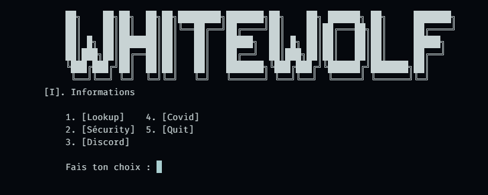

# WhiteWolf Tools

Suite d'outils en ligne de commande (CLI) pour **OSINT**, **sécurité**, **Discord** et utilitaires divers. Nouveau lanceur Tkinter disponible dans `main-tool.py` — l'interface reste aussi accessible en menu ASCII via `main.py`.

> **Python 3 requis** — Windows recommandé (certaines fonctions utilisent `msvcrt`, Microsoft Edge, `taskkill`, `mss`, etc.).

---

## Structure du projet

```
WHITEWOLF-TOOLS/
├── main.py                        # Point d'entrée CLI — menus et logique interactive
├── main-tool.py                   # Interface graphique Tkinter d'accueil
├── api.py                         # Clés API (ipify, apilayer, viewdns) — ignoré par Git
├── sites.py                       # Plateformes pour le lookup username
├── darkweb.py                     # Liens .onion par catégorie (menu Discord → Darkweb)
├── covid.py                       # Script autonome (voir section Covid)
├── scanner.py                     # Scan de tokens Discord (navigateurs + app Discord)
├── builder.py                     # Build .exe de covid.py (PyArmor + PyInstaller)
├── Icon.ico                       # Icône du projet (console / packaging)
├── icon-tool.ico                  # Icône de la fenêtre Tkinter
├── back.gif                       # Fond animé du launcher Tkinter
├── Virus-explain.md               # Guide rapide pour covid.py + builder
├── SECURITY.md                    # Avertissements légaux et responsabilité
├── requirements.txt               # Dépendances pip
├── code/
│   ├── discordchecker.py          # 4C Checker Discord
│   ├── tiktokchecker.py           # 4C Checker TikTok
│   ├── githubchecker.py           # 4C Checker GitHub
│   ├── genip.py                   # Génération d'IP aléatoires → webhook
│   ├── Spamtlgrm.py               # Spam bot Telegram via token bot
│   ├── passwordmanager.py         # Gestionnaire de mots de passe chiffré (Fernet)
│   └── challange/
│       ├── firstchallange.py      # Challenge OSINT interactif
│       └── osint.png              # Image du challenge OSINT
└── README.MD
```

---

## Interface graphique Tkinter (`main-tool.py`)

Lancez l'interface graphique avec :

```bash
python main-tool.py
```

Le lanceur Tkinter affiche un écran d'accueil animé et un bouton **INVESTIGUER**. En cliquant sur ce bouton, il ouvre une fenêtre de terminal et démarre le menu ASCII principal défini dans `main.py`.

### Fichiers associés
- `main-tool.py` : code du launcher Tkinter
- `icon-tool.ico` : icône de la fenêtre Tkinter
- `back.gif` : arrière-plan animé du launcher

---

## Arbre des commandes (`main.py`)

```
python main.py
│
├── [I] Informations ─────────► Telegram, Guns.lol (5 s puis retour)
│
├── 1. LOOKUP
│   ├── [I] Informations
│   ├── 1. IP ──────────────────► geo.ipify.org (pays, ville, ISP, VPN)
│   ├── 2. Number ──────────────► apilayer.net (pays, format, opérateur)
│   ├── 3. Username ────────────► scan multi-sites (sites.py)
│   ├── 4. Google ──────────────► ouvre la recherche dans le navigateur
│   ├── 5. DNS ─────────────────► viewdns.info (abuse contact)
│   ├── 6. Discord ─────────────► vaultcord (profil par ID)
│   ├── 7. Github ──────────────► dernier commit public (email auteur, etc.)
│   ├── 8. Leak Mail ───────────► leakcheck.io → result.json
│   ├── 9. Archive Web ─────────► archive.org (snapshots Wayback)
│   ├── 10. 4C Tiktok ──────────► checker TikTok (code/tiktokchecker.py)
│   ├── 11. 4C Github ──────────► checker GitHub (code/githubchecker.py)
│   └── 12. Quit
│
├── 2. SECURITY
│   ├── [I] Informations
│   ├── 1. PROXY (VPN) ─────────► Edge + proxy HTTP (durée min. 10 s)
│   ├── 2. Gen Password ────────► mot de passe aléatoire (min. 10 car.)
│   ├── 3. Status Website ──────► temps de réponse HTTP (ms)
│   ├── 4. Scraper ─────────────► en-têtes HTTP → result.txt
│   ├── 5. Whois ───────────────► whois du domaine
│   ├── 6. Gen IP ──────────────► génération d'IP (code/genip.py)
│   ├── 7. Spam Telegram ───────► bot spam Telegram (code/Spamtlgrm.py)
│   ├── 8. Passwd Manager ──────► gestionnaire de mots de passe (code/passwordmanager.py)
│   ├── 9. Osint ───────────────► challenge OSINT (code/challange/firstchallange.py)
│   └── 10. Quit
│
├── 3. DISCORD
│   ├── [I] Informations
│   ├── 1. Nitro Gen ───────────► codes gift aléatoires → nitro.txt si valide
│   ├── 2. Spaming Webhook ─────► POST en boucle (toutes les 5 s)
│   ├── 3. Darkweb ─────────────► affiche les liens (darkweb.py)
│   ├── 4. Token BruteForce ────► génère un token factice depuis un ID
│   ├── 5. Bot to id ───────────► URL d'invitation OAuth2 (permissions 8)
│   ├── 6. 4C Checker ──────────► checker Discord (code/discordchecker.py)
│   └── 7. Quit
│
├── 4. COVID (menu utilitaires)
│   ├── 1. KeyLogger ───────────► frappe clavier → webhook Discord
│   ├── 2. Grabing IP ──────────► IP publique → webhook Discord
│   ├── 3. ScreenShot ──────────► capture d'écran → webhook Discord
│   ├── 4. Build Covid ─────────► compile covid.py en .exe (builder.py)
│   └── 5. Quit
│
└── 5. Quit (accueil)
```

**Raccourci global :** `[I]` ou `[i]` sur chaque sous-menu → `show_informations()`.

---

## Détail des fonctionnalités

### Lookup (1)

| Choix       | Entrée           | API / source                        | Sortie                           |
| ----------- | ---------------- | ----------------------------------- | -------------------------------- |
| IP          | Adresse IP       | [ipify](https://geo.ipify.org)      | IP, pays, ville, ISP, VPN        |
| Number      | Numéro E.164     | [apilayer](http://apilayer.net)     | Pays, formats, carrier           |
| Username    | Pseudo           | 30+ sites (`sites.py`)              | URLs où le profil répond 200     |
| Google      | Requête          | Navigateur système                  | Onglet Google Search             |
| DNS         | Domaine          | [viewdns](https://api.viewdns.info) | Abuse contact                    |
| Discord     | ID utilisateur   | vaultcord.com                       | username, avatar, flags, clan…   |
| Github      | user + repo      | api.github.com                      | email/nom/date du dernier commit |
| Leak Mail   | Email            | leakcheck.io                        | `result.json`                    |
| Archive Web | URL              | archive.org                         | Snapshot Wayback le plus proche  |
| 4C Tiktok   | Nombre + webhook | Génération de pseudos               | Résultats via webhook            |
| 4C Github   | Nombre + webhook | Génération d'essais                 | Résultats via webhook            |

**Sites username** (extrait) : GitHub, Reddit, TikTok, Instagram, X, Facebook, Twitch, Steam, GitLab, Medium, Roblox, Chess.com, Linktree, Gravatar… — liste complète dans `sites.py`.

### Security (2)

| Choix          | Description                                                                                                                         |
| -------------- | ----------------------------------------------------------------------------------------------------------------------------------- |
| PROXY (VPN)    | Lance Microsoft Edge avec `--proxy-server`, vérifie l'IP via ipify, arrêt au timeout ou touche clavier                              |
| Gen Password   | `ascii_letters` + `digits` + `punctuation`, longueur ≥ 10                                                                           |
| Status Website | `GET` sur l'URL → délai en millisecondes                                                                                            |
| Scraper        | `HEAD` → affiche et enregistre les headers dans `result.txt`                                                                        |
| Whois          | Informations WHOIS du domaine (registrar, dates, DNS…)                                                                              |
| Gen IP         | Génère des adresses IP aléatoires et les envoie via webhook                                                                         |
| Spam Telegram  | Bot spam Telegram — demande un token bot + message, envoie 98 fois en boucle via `/start`                                           |
| Passwd Manager | Gestionnaire de mots de passe chiffré via Fernet (gen clé, ajout mdp chiffré, déchiffrement)                                        |
| Osint          | Challenge OSINT interactif — trouver une ville, un office de tourisme et une date à partir d'une image (`code/challange/osint.png`) |

### Discord (3)

| Choix            | Description                                                  | Fichier généré |
| ---------------- | ------------------------------------------------------------ | -------------- |
| Nitro Gen        | Teste `https://discord.gift/{16 chars}` en boucle            | `nitro.txt`    |
| Spaming Webhook  | Envoie `{ "content": message }` en POST                      | —              |
| Darkweb          | Liste par catégorie (moteurs, marchés, wikis…)               | —              |
| Token BruteForce | `base64(user_id).random.random` (démo, non fonctionnel réel) | —              |
| Bot to id        | Lien `oauth2/authorize` admin (perm 8)                       | —              |
| 4C Checker       | Génération / vérification de pseudos Discord                 | —              |

**Catégories Darkweb** (`darkweb.py`) : Search Engine, Bitcoin Anonymity, DDoS, Market, Cooks, Torrents, Social Media, Wikis, Government, Communities, Educational.

### Covid (4)

| Choix       | Description                                                      |
| ----------- | ---------------------------------------------------------------- |
| KeyLogger   | `pynput` → chaque touche postée sur un webhook (buffer 1 s)      |
| Grabing IP  | IP via `checkip.amazonaws.com` → webhook                         |
| ScreenShot  | Capture d'écran via `mss` → webhook Discord                      |
| Build Covid | Ouvre `builder.py` — compile `covid.py` en `covid-exe/Tools.exe` |

#### Script autonome `covid.py`

`covid.py` regroupe plusieurs actions au lancement (webhook à configurer ligne 40) :

1. **Discord injection** — scan des tokens via `scanner.py` (Chrome, Brave, Edge, Opera, Discord…)
2. **Grab IP** — envoi de l'IP publique
3. **Dir** — listing `dir /s` (tronqué à 1900 car.)
4. **Screenshot** — capture d'écran
5. **Dossier** — création de dossiers `Virus*` sur le bureau + ouverture de `cmd`
6. **Shutdown** — redémarrage forcé de la machine
7. **KeyLogger** — écoute clavier en arrière-plan

> Guide pas à pas : voir [`Virus-explain.md`](Virus-explain.md).

#### Builder (`builder.py`)

Pipeline de compilation :

1. Choix d'une icône `.ico` (dialogue Tkinter)
2. Obfuscation avec **PyArmor** (`obf/covid.py`)
3. Packaging **PyInstaller** (`--onefile --noconsole`) → `covid-exe/Tools.exe`

Dépendances build : `pyarmor`, `pyinstaller`.

#### Scanner (`scanner.py`)

Scan des tokens Discord stockés localement :

- Navigateurs Chromium (Chrome, Brave, Edge, Opera, Vivaldi, Yandex…)
- Applications Discord (stable, PTB, Canary, Dev)
- Décryptage via `win32crypt` + `pycryptodome` (optionnel)

Test en standalone :

```bash
python scanner.py
```

### Password Manager (`code/passwordmanager.py`)

Gestionnaire de mots de passe avec chiffrement **Fernet** (symétrique AES) :

| Option    | Description                                                 |
| --------- | ----------------------------------------------------------- |
| Gen Key   | Génère une clé Fernet → `key.txt`                           |
| Add Mdps  | Chiffre un mot de passe avec la clé → `encrypted.txt`       |
| List mdps | Déchiffre et affiche le mot de passe depuis `encrypted.txt` |

> ⚠️ Conserve ta `key.txt` — sans elle, le déchiffrement est impossible.

### Spam Telegram (`code/Spamtlgrm.py`)

Bot spam Telegram activé via la commande `/start` :

- Demande un **token bot** Telegram et un **message** à spammer
- Envoie le message **98 fois** à chaque commande `/start`
- Fonctionne en boucle continue (`run_polling`)

### Challenge OSINT (`code/challange/firstchallange.py`)

Challenge de géolocalisation OSINT interactif basé sur une image (`osint.png`) :

| Question                        | Format attendu                                          |
| ------------------------------- | ------------------------------------------------------- |
| Nom de la ville                 | minuscules                                              |
| Nom de l'office de tourisme     | minuscules (sans le préfixe "Destination Méditerranée") |
| Date de publication de la photo | `jj/mm/aaaa`                                            |

Score sur 3 points — un point par bonne réponse.

---

## Installation

```bash
git clone <url-du-repo>
cd WHITEWOLF-TOOLS
pip install -r requirements.txt
python main.py
```

### Dépendances (`requirements.txt`)

| Package               | Usage                                              |
| --------------------- | -------------------------------------------------- |
| `requests`            | Toutes les requêtes HTTP                           |
| `pynput`              | KeyLogger (menu Covid + `covid.py`)                |
| `mss`                 | Captures d'écran                                   |
| `python-telegram-bot` | Spam bot Telegram (`code/Spamtlgrm.py`)            |
| `python-whois`        | Lookup WHOIS (menu Security)                       |
| `cryptography`        | Chiffrement Fernet (`code/passwordmanager.py`)     |
| `pillow`              | Manipulation d'images (`ransom_ware.py`)           |
| `pywin32`             | Décryptage des tokens (`scanner.py`)               |
| `pycryptodome`        | Décryptage AES des cookies Chromium (`scanner.py`) |
| `pyarmor`             | Obfuscation avant build (`builder.py`)             |
| `pyinstaller`         | Compilation en `.exe` (`builder.py`)               |

Modules standard utilisés : `os`, `time`, `json`, `webbrowser`, `msvcrt`, `tempfile`, `subprocess`, `random`, `string`, `base64`, `threading`, `sqlite3`, `io`, `tkinter`.

---

## Configuration API (`api.py`)

Le fichier `api.py` est **ignoré par Git** (`.gitignore`). Crée-le à la racine du projet :

```python
api_ip = "ta_cle_ipify"
api_number = "ta_cle_apilayer"
api_dns = "ta_cle_viewdns"
```

| Variable     | Service                                      | Utilisé pour       |
| ------------ | -------------------------------------------- | ------------------ |
| `api_ip`     | [geo.ipify.org](https://geo.ipify.org)       | Lookup IP          |
| `api_number` | [apilayer.net](http://apilayer.net)          | Lookup téléphone   |
| `api_dns`    | [api.viewdns.info](https://api.viewdns.info) | Lookup DNS / abuse |

Remplace les valeurs par **tes propres clés** — ne commite jamais de secrets en public.

Les autres lookups (Discord, Github, Leak Mail, Google, Archive) n'utilisent pas `api.py`.

---

## Fichiers générés à l'exécution

| Fichier / dossier         | Créé par                                            |
| ------------------------- | --------------------------------------------------- |
| `result.json`             | Lookup → Leak Mail                                  |
| `result.txt`              | Security → Scraper                                  |
| `nitro.txt`               | Discord → Nitro Gen (codes potentiellement valides) |
| `key.txt`                 | Security → Passwd Manager → Gen Key                 |
| `encrypted.txt`           | Security → Passwd Manager → Add Mdps                |
| `covid-exe/Tools.exe`     | Covid → Build Covid (`builder.py`)                  |
| `build/`, `dist/`, `obf/` | Dossiers temporaires du builder (supprimés/recréés) |

---

## Fichiers ignorés par Git (`.gitignore`)

| Fichier / pattern                  | Raison                                |
| ---------------------------------- | ------------------------------------- |
| `api.py`                           | Clés API secrètes                     |
| `*.json`, `*.txt`                  | Fichiers de résultats et clés générés |
| `*.log`, `*.tmp`                   | Fichiers temporaires                  |
| `ransom_ware.py`                   | Script sensible exclu du dépôt        |
| `__pycache__/`, `*.pyc`            | Bytecode Python                       |
| `env/`, `venv/`, `.venv/`          | Environnements virtuels               |
| `.env`, `config.json`, `keys.json` | Configs secrètes                      |
| `profile/`, `webdriver/`           | Données de session navigateur         |

---

## Liens & crédits

- **Telegram** — https://t.me/whitewolf_tools
- **Guns.lol** — https://guns.lol/xqldev

---

## Avertissement

Utilise ces outils uniquement sur des systèmes et des données **dont tu as l'autorisation**. Les fonctions type keylogger, scan de tokens, spam webhook ou génération de tokens peuvent violer les lois et les conditions d'utilisation des services concernés.

Consulte [`SECURITY.md`](SECURITY.md) pour les conditions complètes d'utilisation et de responsabilité.

## Image






---

_Love My friends :)_ — _Don't wait, just do it :)_
